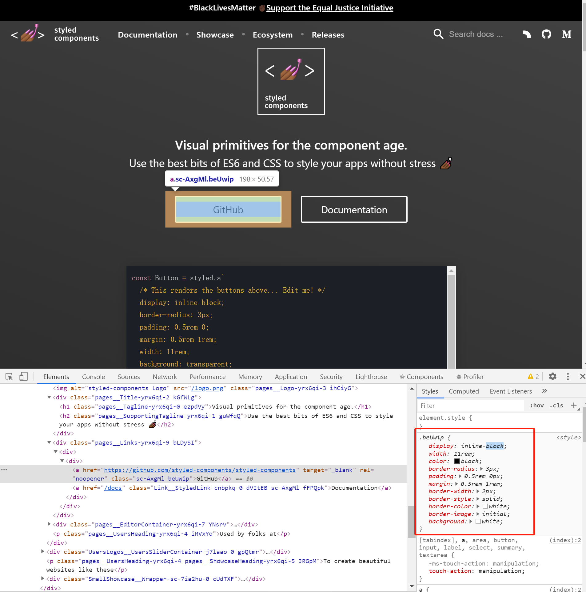

不知道大家有没有遇到过这种情况：当访问一个用了 styled-components 技术的网站，打开开发者工具，想要修改下样式的时候，发现有些样式修改不了（注：chrome 更新后可以修改了，现在主要介绍下这项技术）。

<!-- truncate -->

这里拿 styled-components 官网作为例子展示下效果：


可以在控制台样式区域，看到如图由 styled-componets 生成的 class 名称对应的样式是不可以编辑的。看到这个情况，我的好奇心就被勾起来了。随着一步步的探索实验，最终破解了这个谜团。下面来还原破案过程。

## 破案步骤

当点击样式规则右上角，准备追溯来源时，跳转到了一个没有内容的 style 标签。`<style data-styled="active" data-styled-version="5.1.0"></style>`

记得以前看到过 js 操作样式表的 API，于是在 MDN 上搜索相关 API, 没有看到直接创建样式的接口。但发现了一行文字: `Constructable Stylesheet Objects`. 并且 MDN 上说到 Blink 平台早已支持该 API.

使用示例
```javascript
const mySheet = new CSSStyleSheet();
mySheet.addRule('h2', 'color: red', 0);
document.adoptedStyleSheets = [mySheet]
```
[参考](https://developer.mozilla.org/zh-CN/docs/Web/API/CSSStyleSheet)
[参考](https://wicg.github.io/construct-stylesheets/)
